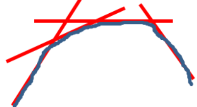

- Topic: The Lagrange dual function
- Last revised: Feb. 10, 2023

---

# Review: The Lagrange

Please refer to the corresponding file. In addition, check Section 5.1.1 in (Boyd 2009).

# The Definition of Lagrange Dual Function

For the Lagrangian, there are three vector variables, $x$, $\lambda$ and $v$. If $x$ is considered to be known to be the point that the Lagrangian is minimum over $x$, only those dual variables are left. It is interesting to find out the relation of the origin optimization problem with respect to $x$ and the formulated optimization problem with respect to $\lambda$ and $v$.

The *Lagrangian dual function* is defined with only the dual variables

$$g(\lambda,v)=\inf_{x\in\mathcal{D}}\mathcal{L}(x,\lambda,v)=\inf_{x\in\mathcal{D}}\left(f_0(x)+\sum_{i=1}^{m}\lambda_if_i(x)+\sum_{i=1}^{p}v_ih_i(x)\right).$$

# Properties

1. When the Lagrangian is unbounded below in $x$, $g(\lambda,v)=-\infty$.
2. The Lagrangian dual function is *dual feasible* if $\lambda\succeq0$ and $g(\lambda,v)>-\infty$.
3. $g(\lambda,v)$ is concave in $(\lambda,v)$ since it is the pointwise infimum of a family of affine functions of $(\lambda,v)$. That's to say, for every $\lambda_i$ and $v_i$, we should the smallest values of $x$. This is true even when the original optimization problem is not convex.
    

    Fig: Piecewise infimum is a concave function.
4. The dual function is a lower bound of the optimal value $p^*$ of the original optimization problem, i.e. $g(\lambda,v)\leq p^*$.

Property 3 is important. And it is also easy to verify. If $\tilde{x}$ is the optimal point, then $f_i(\tilde{x})\leq0$ and $h_i(\tilde{x})=0$, and without loss of generality, $\lambda\geq0$. Then we have $\sum_{i=1}^{m}\lambda_if_i(\tilde{x})+\sum_{i=1}^{P}v_ih_i(\tilde{x})\leq0$. Finally, we have

$$\mathcal{L}(\tilde{x},\lambda,v)=f_0(\tilde{x})+\sum_{i=1}^{m}\lambda_if_i(\tilde{x})+\sum_{i=1}^{p}v_ih_i(\tilde{x})\leq f_0(\tilde{x}).$$

Therefore, we have

$$g(\lambda,v)=\inf_{x\in\mathcal{D}}\mathcal{D}(x,\lambda,v)\leq\mathcal{L}(\tilde{x},\lambda,v)\leq f_o(\tilde{x})=p^*.$$

The Lagrange dual function must be lower the optimal value (minimum of the objective function) of the original optimization problem. On other words, the Lagrange dual function achieves always better performance of the original optimization problem. This is because we introduce some extra terms from the constraints of the original problem in Lagrangian.

# The Lagrangian dual function is a linear approximation of an infinitely-hard displeasure function