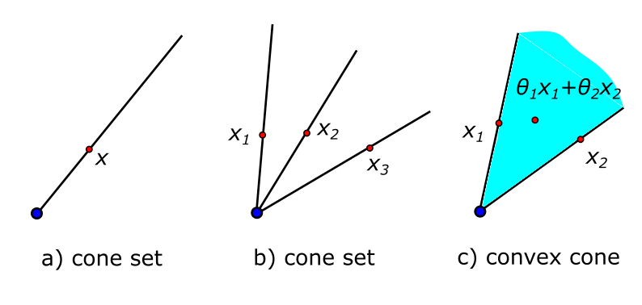

- Keywords: cone set, second-order cone programming, second-order cone constraint, quadratic programming
- Last Update: Mar. 08, 2022

---

# What is a cone?

In Section 2.1.5, a set $C$ is called a *cone* if for every $x\in C$ and $\theta\geq0$ we have $\theta x\in C$. We can see that the cone set has a apex at $x=0$. Note that a cone is not convex unless it is reduced to a ray. Then a convex cone is defined to be if for any $x_1,x_2\in C$ and $\theta_1,\theta_2\geq0$ we have $\theta_1x_1+\theta_2x_2\in C$. Note that every cone has an *apex* at $x=0$.

In Section 2.2.3, the *norm cone* is defined with the norm $\|\cdot\|$ in such a form

$$C=\left\{(x,t)|\|x\|\leq t\right\}.$$

If the vector $x$ is in two dimension, i.e. $x=[x_1,x_2]^T$, the norm becomes $\|x\|_2=\sqrt{x_1^2+x_2^2}$. The norm cone is then in $\mathbb{R}^3$ and can be writtena as

$$\left\{(x_1,x_2,t)|(x_1^2+x_2^2)^{1/2}\leq t\right\},$$

which is also called the *second-order cone*. It is a convex cone.

# Standard form of second-order cone programming (SOCP).

## Definition of SOCP

**Definition.** If a problem can be written as

$$\begin{aligned}
  (P1)\quad\min\quad & f^Tx \\
  \text{s. t.}\quad & \|A_ix+b_i\|_2\leq c^T_ix+d_i,\quad i=1,\cdots,m\\
  & Fx=g,
\end{aligned}$$

where the optimization variable $x\in\mathbb{R}^n$, and $A_i\in\mathbb{R}^{n_i\times n}$, $F\in\mathbb{R}^{p\times n}$, we call it the *second-order cone program* (SOCP). (P1) is also referred to be the *standard form* of SOCP. $\blacksquare$

If we rewrite the first constraint to $f_i(x)=\|A_ix+b_i\|_2-c_i^Tx-d_i$, the standard-form SOCP is a *convex* problem in standard form. Note that $f_i(x)$ is convex because it is basically a convex cone of an image of affine functions. The affine function preserves the convexity of the set.

## Relation to LP and QCQP

SOCP is related to *quadratic programming (QP)* and *linear programming (LP)*. When $c_i=0,i=1,\cdots,m$, SOCP is equivalent to *quadratically constrained quadratic programming (QCQP)*. When $A_i=0,i=1,\cdots,m$, SOCP is reduced to LP.

## Why call it "second-order cone"?

In (P1), the constraint $\|A_ix+b_i\|_2\leq c^T_ix+d_i,\quad i=1,\cdots,m$ is called *second-order cone constraint*. It is a cone because the affine function $(A_ix+b_i,c_i^Tx+d_i)$ is in a cone (note that a cone is in the form that the norm of an affine function is less than an affine function). "Second-order" comes from the Euclidean norm $\|\cdot\|_2$, which is related to the square of $x$. Note that the norm in a cone can be any norm.

# Examples of SOCP

## Robust linear programming

Consider a *linear program in inequality form*

$$\begin{aligned}
  \min\quad&c^Tx\\
  \text{s.t.}\quad&a_i^Tx\leq b_i,\quad i=1,\cdots,m,
\end{aligned}$$

Consider further there is some uncertainty in $a_i$ while $c$ and $b_i$ are fixed. $a_i$ are constrained in ellipsoids

$$a_i\in\mathcal{E}_i=\left\{\bar{a}_i+P_iu|\|u\|_2\leq1\right\},$$

where $P_i\in\mathbb{R}^{n\times n}$. Note that if $P_i$ is singular, $\textbf{rank}P_i<n$, we obtain "flat" ellipsoids. If $P_i=0$, $a_i=\bar{a}_i$, meaning that $a_i$ is known perfectly, i.e., no uncertainty.

The optimization is called *robust linear program* is the constraints are satisfied for all possible values of the prarmeters $a_i$

$$\begin{aligned}
  \min\quad&c^Tx\\
  \text{s.t.}\quad&a_i^Tx\leq b_i,\forall a_i\in\mathcal{E}_i,i=1,\cdots,m.
\end{aligned}$$
 
# Solving a SOCP

## Interior point method

