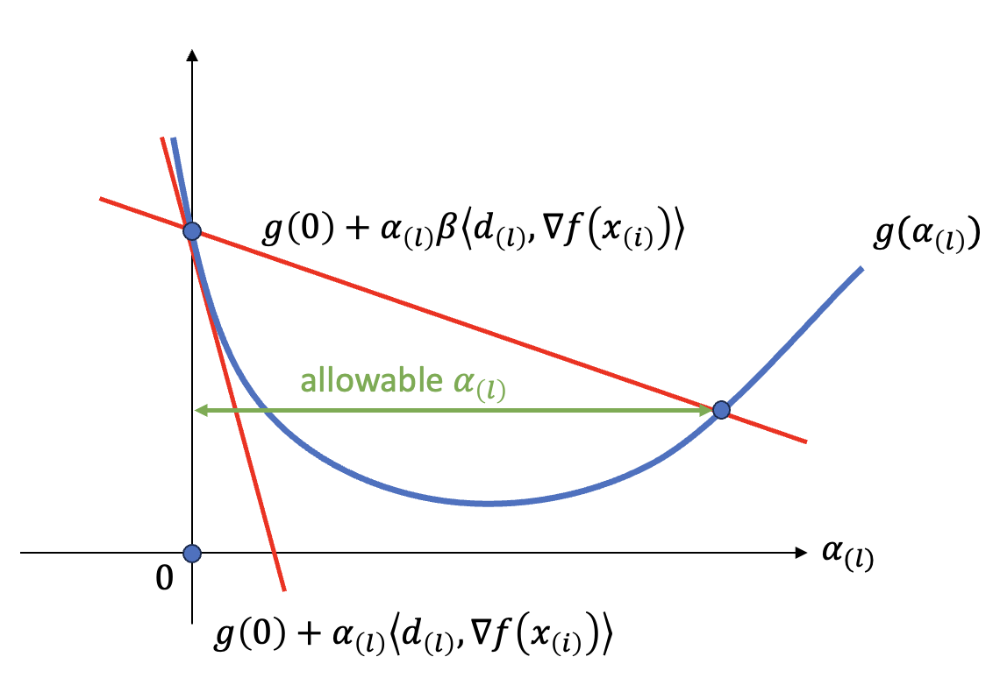

- **Topics**: Backtracking Line Search
- **Last Revised**: Jan. 22, 2024

---

# The Line Search Method

Consider an unconstrained optimization problem with an objective function $f:\mathbb{R}^n\rightarrow\mathbb{R}$

$$\min_{x\in\mathbb{R}^n} f(x).$$

The line search method is to update $x$ at the $i$-th iteration according to the following scheme

$$x_{(i+1)}=x_{(i)}+\alpha_{(i)}d_{(i)},$$

where $\alpha_{(i)}$ is the step size and $d_{(i)}$ is the search direction at the $i$-th iteration. The *backtracking line search* method is to find a resonable approximate of the optimal $\alpha_{(i)}$ while ensuring the objective function is reduced.

The step size can be too large or too small

- too large: the data can bounce from one side to another of the minimium, so that reaching to the minimium point slowly.
- too small: makes the objective function decreases very little at each iteration and therefore reach to the minimum point slowly.

# Backtracking Line Search: Shrinking $\alpha$ with A Fixed Rate

Given a search direction $d_{(i)}$, instead of directly solving the optimization problem

$$\alpha_{(i)}^{\text{opt}}=\arg\min_{\alpha_{(i)}}g(\alpha_{(i)}),\qquad(1)$$

where $g(\alpha_{(i)})=f(x_{(i)}+\alpha_{(i)}d_{(i)})$ is a function of step size, the backtracking line search is an iterative method to obtain a good approxmation $d_{(i)}$ that close enough to $\alpha_{(i)}^{\text{opt}}$. To prevent the step size from getting too small, one straightforward idea is to reduce the step size gradually when the data approaches to the optimal point. The advantage of such an iterative algorithm to acquire $\alpha$ over Eq. (1) is that offloading computing resources to establishing new search direction results in the end in lower overall complexity.

The backtracking line search starts with a large estimate of $\alpha$ and then iteratively schrinks it. One straightforward idea is to schrink $\alpha$ with a fixed rate until the change of $\alpha$ provides sufficient decrease to the objective function ($\epsilon$ defines the desired decrease that is expected).

||Backtracking Line Search with Fixed Rate Shrinking|
|:--|:--|
|1|Given $\alpha_{\text{init}}>0$ (e.g., $\alpha_{\text{init}}=1$), let $\alpha_{(0)}=\alpha_{\text{init}}$ and $l=0$.|
|2|Until $f(x_{(i)})-f(x_{(i)}+\alpha_{(l)}d_{(i)})\geq\epsilon$ where $\epsilon>0$|
||i) set $\alpha_{(l+1)}=\tau\alpha_{(l)}$, where $\tau\in(0,1)$ is fixed (e.g., $\tau=1/2$),|
||ii) $l=l+1$|
|3|Set $\alpha_{(i)}=\alpha_{(l)}$.|

This algorithm can prevent the step size from being to small. Why? Let's assume a very small $\epsilon$, the algorithm stops very early and returns a step size close to the initial value, which is assumed to be large enough. However, this algorithm doesn't prevent the step size from being to large. To overcome it, the threshold $\epsilon$ needs to be larger, so that even though we have large intial value, we have a reasonable step size. The backtracking line search methods tend to be cheap, and work very well in practice.

# In Gradient Descent: Armijo Condition

In 1966, Larry Armijo proved that $f(x_{(i)})-f(x_{(i)}+\alpha_{(l)}d_{(i)})$ should be larger than a positive value related to the gradient (Armijo, 1966). In 1962, Goldstein gave similar analysis already for Newton's method (Goldstein, 1962). Both methods are unified and known as *Armijo-Goldstein condition*.

||Backtracking Line Search with Armijo Condition|
|:--|:--|
|1|Given $\alpha_{\text{init}}>0$ (e.g., $\alpha_{\text{init}}=1$), let $\alpha_{(0)}=\alpha_{\text{init}}$ and $l=0$.|
|2|Until $f(x_{(i)})-f(x_{(i)}+\alpha_{(l)}d_{(i)})\geq-\alpha_{(l)}\beta\langle d_{(i)},\nabla f(x_{(i)})\rangle$, where $\beta\in(0,1)$ is fixed (e.g., $\beta=1/2$).|
||i) set $\alpha_{(l+1)}=\tau\alpha_{(l)}$, where $\tau\in(0,1)$ is fixed (e.g., $\tau=1/2$),|
||ii) $l=l+1$|
|3|Set $\alpha_{(i)}=\alpha_{(l)}$.|

For steepest descent, $d_{(i)}=-\nabla f(x_{(i)})$, and therefore the Armijo condition becomes $f(x_{(i)})-f(x_{(i)}+\alpha_{(l)}d_{(i)})\geq\alpha_{(l)}\beta|\nabla f(x_{(i)})|^2$. Armijo condition can ensure that the step size is not too large. Why, let's have a look. To simplify, we assume a convex function $f$. Otherwise, there can be multiple local minima. $g(\alpha_{(l)})$ is then a convex function of $\alpha_{(i)}$. The Armijo condition can be rewritten as

$$g(\alpha_{(l)})\leq f(x_{(i)})+\alpha_{(l)}\beta\langle d_{(i)},\nabla f(x_{(i)})\rangle=g(0)+\alpha_{(l)}\beta\langle d_{(i)},\nabla f(x_{(i)})\rangle.$$

Since $g(\alpha_{(l)})$ is also a convex function, we have

$$g(\alpha_{(l)})\geq g(0)+\alpha_{(l)}\langle d_{(i)},\nabla f(x_{(i)})\rangle.$$

As a result, $g(\alpha_{(l)})$ is constrained by a lower bound line and a upper bound line. An example is illustrated below

Within the allowable $\alpha_{(l)}$ satisfying the Armijo condition, the guaranteed reduction of $f$ is proportional to $\alpha_{(l)}$. So we would like to choose the a $\alpha_{(l)}$ within such an allowable range.

A common choice of initial step size is $\alpha_{\text{init}}=1$, but can vary somewhat in different problem. The choice of $\beta$ can range from extremely small ($10^4$, encouraging larger steps) to relatively large (0.3, encouraging smaller steps), and typical values of $\tau$ range from 0.1, (corresponding to a relatively coarse search) to 0.8 (corre-
sponding to a finer search).
